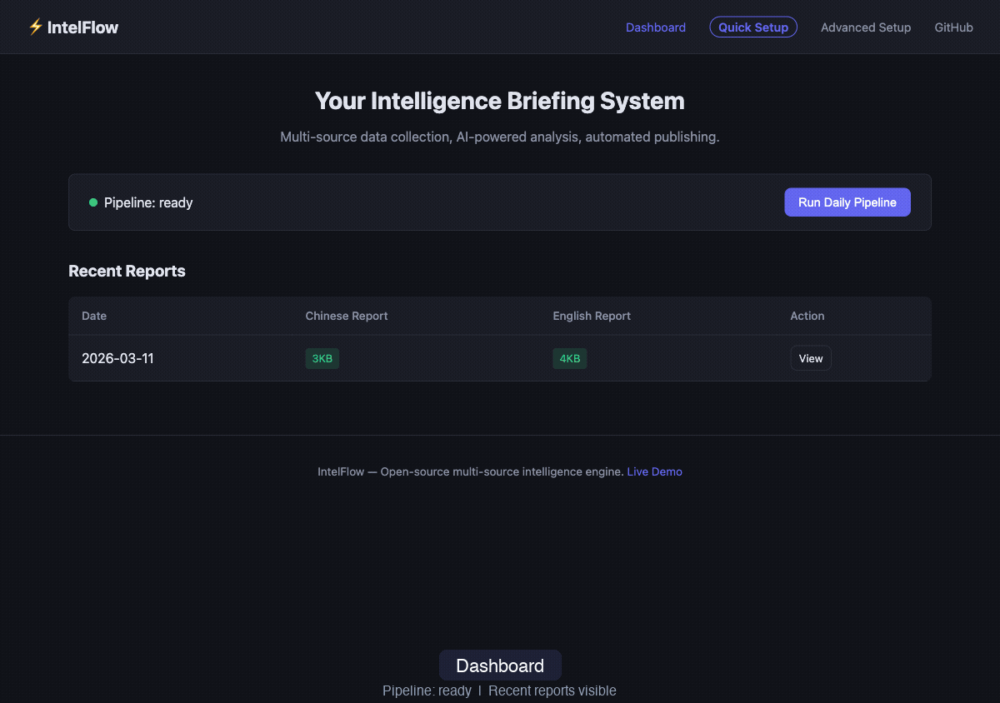

<p align="center">
  <h1 align="center">IntelFlow — 你的专属 AI 情报引擎</h1>
  <p align="center"><strong>一个 API Key，告诉它你关注什么，每天自动生成双语深度日报。</strong></p>
</p>

<p align="center">
  <a href="LICENSE"></a>
  
  <a href="https://github.com/lizecheng2021-maker/IntelFlow/pulls"></a>
  <a href="https://www.lizecheng.net"></a>
</p>

**[English](README.md)** | 中文

---



全球唯一同时满足：

- **中英双语原生生成** — 不是翻译，两套独立编辑人格同步输出
- **微信公众号 + 飞书 + WordPress 三端一键发布** — 没有任何其他开源项目做到这三个
- **完全自定义分析维度** — AI/金融/加密/生物科技/SEO，你说了算
- **支持所有主流大模型** — Claude、GPT-4、Gemini、通义千问、智谱 GLM，或本地 Ollama
- **完全自部署，生产级可靠性，无供应商绑定，无按篇收费**

---

## 为什么是 IntelFlow？

| | Morning Brew / The Rundown | Feedly / Curated | hn-digest / newsletter-gpt | **IntelFlow** |
|---|---|---|---|---|
| 双语原生输出 | 无 — 仅英文 | 无 — 仅英文 | 无 — 仅英文 | **有 — 中英同步** |
| 微信 + 飞书 + WordPress | 无 | 无 | 无 | **有 — 一条命令** |
| 自定义分析维度 | 无 — 固定选题 | 无 — 手动整理 | 无 — 话题写死 | **有 — 完全可配** |
| 真实编辑人格 | 需要大型团队 | 不适用 | 通用 AI 腔调 | **配置文件搞定，不需要团队** |
| 自部署 + 生产级 | 无 | 无 | 业余项目，JSON 存储脆弱 | **有 — 内置故障转移** |
| 成本 | 订阅费 | 订阅费 | 免费但能力有限 | **约 $2-3/天，你完全拥有** |

Morning Brew 这类商业产品需要大型编辑团队才能维持稳定的编辑风格。现有开源替代品是业余项目，没有发布流水线，存储方式也不可靠。IntelFlow 是唯一一个同时做到生产级稳定性和真实编辑人格的自部署系统——通过配置文件驱动，不需要团队。

---

## 实际产出

看看 IntelFlow 在生产环境跑出来的效果：

- **英文日报：** [www.lizecheng.net](https://www.lizecheng.net)
- **中文日报（飞书）：** [飞书文档](https://xv7exvpv861.feishu.cn/wiki/Sh8OwOyqningOvkE8MAcYSOwn8e)

你的产出会完全不同——取决于你定义的维度、你选的模型和你配置的编辑风格。

---

## 快速开始

```bash
# 1. 克隆项目
git clone https://github.com/lizecheng2021-maker/IntelFlow.git
cd IntelFlow

# 2. 安装依赖
python3 -m venv venv
source venv/bin/activate
pip install -r requirements.txt

# 3. 打开 Web 面板，粘贴一个 API Key，设定关注领域，完成
python web/app.py
# 浏览器打开 http://localhost:5050
```

这就是全部设置。运行第一次日报：

```bash
bash scripts/run_daily.sh
```

一个 API Key 就能启动。其他——发布目标、额外数据源、编辑人格——都是可选配置。

---

## 你能拿到什么

一次完整的日报流程输出：

```
output/2026-03-11/
├── daily_zh.md          # 中文日报（约 4000-5000 字）
├── daily_en.md          # 英文日报（约 4000-5000 字，独立编辑视角）
├── cover_zh.png         # AI 生成封面图
├── cover_en.png         # AI 生成封面图
└── briefing.json        # 结构化原始数据
```

**日报结构**（根据你配置的维度自动调整）：

```
30 秒速览
─────────────────
[你的维度 1]   例如：AI 动态 — 3-5 条，每条有独立判断
[你的维度 2]   例如：加密货币 — 信号，不是摘要
[你的维度 3]   例如：SaaS — 竞品动作、融资信号
...
今日精华        跨维度串联洞察，400-600 字
```

每条不是标题搬运，AI 跨维度交叉验证信号，识别结构性变化后给出判断。

**输出节奏：**

| 格式 | 篇幅 | 周期 |
|------|------|------|
| 日报 | 4000-5000 字 | 每天 |
| 周报 | 8000-10000 字 | 聚合分析 |
| 月报 | 12000-15000 字 | 趋势综合 |

---

## 配置你的领域

IntelFlow 的核心概念是**维度**——AI 用来组织研究方向的独立分析轨道。在 Web 面板一次性定义好。

**加密货币交易员：**
- 市场信号 30% | 链上数据 25% | 监管动态 20% | DeFi 协议 15% | 宏观 10%

**SaaS 创始人：**
- 竞品情报 25% | 用户痛点 25% | 技术栈 20% | 融资动向 15% | 增长策略 15%

**学术研究者：**
- 论文发布 30% | 基金资助 20% | 会议动态 20% | 产业应用 15% | 政策影响 15%

**游戏开发者：**
- 行业动态 30% | 技术发布 25% | 社区舆情 20% | 竞品动向 15% | 平台政策 10%

除了维度，你还可以配置：

- **编辑人格** — 语气、风格、口头禅、分析深度
- **语言输出** — 仅中文、仅英文，或双语同步
- **发布目标** — 微信公众号、飞书、WordPress，或只看本地 Markdown
- **AI 模型** — 在 Claude、GPT-4、Gemini、通义、智谱或本地 Ollama 之间随时切换，无需改代码

---

## 系统架构

```
                        IntelFlow 流水线（约 25 分钟）
 ============================================================================

 采集（并行）                预处理              生成（并行）               发布
 ______________________     ___________         ____________________     ________
| Web 搜索              |   |           |       |                    |   |        |
| RSS 订阅              |   |  prepare  |       |  板块 1（中+英）    |   | 微信   |
| Hacker News          |-->|  briefing |--+--->|  板块 2（中+英）    |-->| 飞书   |
| GitHub Trending      |   |   .py     |  |   |  板块 3（中+英）    |   | WP     |
| Reddit               |   |___________|  |   |  板块 N（中+英）    |   |________|
| YouTube 转录          |        |         |   |____________________|
| 自定义采集器           |        v         |            |
|______________________|   AI 搜索验证     |            v
                                          |     assemble_report.py
                                          +------------+
```

**关键设计：**

- 每个采集器有 10 分钟超时——单个慢源不会阻塞整条流水线
- AI 模型可插拔——切换厂商不需要改任何流水线代码
- 失败板块自动重试一次，不影响其他板块
- 内置采集器（RSS、HN、GitHub、Reddit、YouTube）无需额外 API Key
- 双语生成并行运行——不是先生成一种语言再翻译

**扩展自定义采集器：**

```bash
# 创建 scripts/collect_mydata.py
# 接受 --date 和 --output 参数，输出 raw_mydata.json
# 就这样——流水线自动发现 collect_*.py 脚本
```

---

## 支持的 AI 模型

| 厂商 | 模型 | 说明 |
|------|------|------|
| Anthropic | Claude Sonnet / Opus / Haiku | 分析深度最强 |
| OpenAI | GPT-4o / GPT-4o-mini / o1 | 全球可用 |
| Google | Gemini 2.5 Pro / Flash | 有免费额度 |
| 智谱 AI | GLM-4-Plus / GLM-4 | 中文能力优秀 |
| 阿里通义 | Qwen-Max / Plus / Turbo | OpenAI 兼容接口 |
| Ollama | Llama 3 / Mistral / Qwen2 | 100% 本地运行，无需 API |

---

## 参与贡献

欢迎贡献：

- **新数据采集器** — 更多 RSS、API 或平台适配器
- **AI 模型适配** — 支持更多大模型厂商
- **发布平台** — Substack、Medium、Ghost、LinkedIn 等
- **Web 界面** — 更好的引导流程、实时进度

重大改动请先开 Issue 讨论。

---

## 开源协议

**[MIT + Commons Clause](LICENSE)**

| 使用场景 | 费用 |
|----------|------|
| 个人使用、自部署 | 免费 |
| 学习、开源贡献、fork 改造 | 免费 |
| 商业部署（SaaS、代理服务、嵌入付费产品）| $1,000 USD / 部署授权 |

商业授权咨询：[GitHub Issues](https://github.com/lizecheng2021-maker/IntelFlow)

---

<p align="center">
  如果 IntelFlow 对你有帮助，欢迎给个 Star。<br>
  <a href="https://github.com/lizecheng2021-maker/IntelFlow">github.com/lizecheng2021-maker/IntelFlow</a>
</p>
